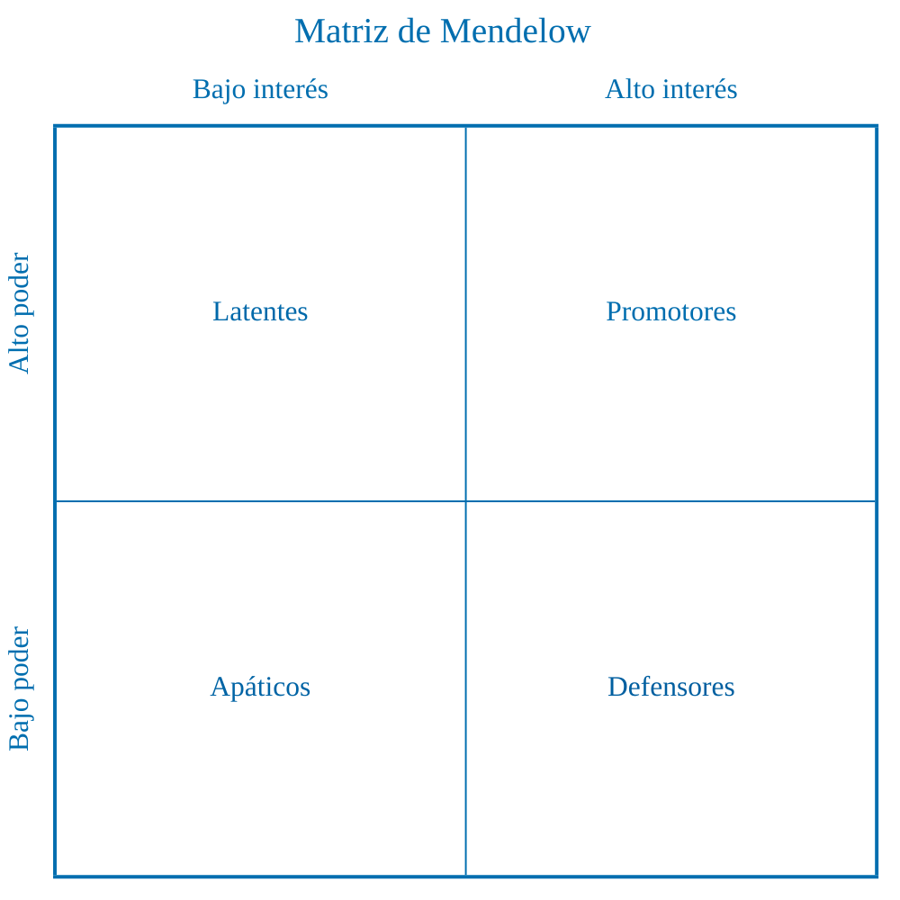

# 2 Técnicas y herramientas

## 2.1 Relevamiento

<!-- cSpell:words Mendelow -->

### 2.1.12 Matriz de poder e interés o matriz de Mendelow

El mapeo de interesados —o de grupos de interés, *stakeholder management* en
inglés— sirve para identificar expectativas y poder de los distintos
interesados, y así clarificar prioridades políticas.

Este documento está basado en [^1].

[^1]: Johnson, G.; Scholes, K.; Whittington, R. (2005). Exploring Corporate
Strategy, 7th Edition. Prentice Hall. Disponible
[aquí](https://scholar.google.com/scholar?hl=en&as_sdt=0%2C5&q=K+Scholes%2C+G+Johnson%2C+R+Whittington+exploring+corporate+strategy+7th+edition&btnG=).

Se centra en dos preguntas:

* Qué tanto quiere cada interesado influir en los objetivos y estrategias de la
  organización —nivel de interés—.

* Qué capacidad real tiene para lograrlo —poder—.

La matriz de Mendelow es una matriz de dos por dos que clasifica a los
interesados en cuatro cuadrantes según su poder y su interés en una estrategia,
iniciativa o proyecto concreto.

* **Alto poder y alto interés: promotores**. Involucrar muy de cerca, gestionar
  activamente, escuchar y co‑crear.

* **Alto poder y bajo interés: latentes**. Mantener satisfechos, informar lo
  justo y alinearlos con los objetivos clave.

* **Bajo poder y alto interés: defensores**. Mantener informados, pedir
  retroalimentación y utilizarlos como aliados y soporte.

* **Bajo poder y bajo interés: apáticos**. Monitorizar con esfuerzo mínimo, sin
  sobrecargarlos con información.

El mapeo de interesados ayuda a:

* Comprobar si el poder e interés reales encajan con el marco de gobernanza
  corporativa esperado —por ejemplo, reforzar el rol de consejeros no ejecutivos
  mediante mejor información—.

<!-- cSpell:words facilitadores https://dle.rae.es/facilitador -->

* Identificar bloqueadores y facilitadores de una estrategia y diseñar
  respuestas —educar, persuadir, negociar—.

* Decidir si es deseable y posible cambiar la posición de algunos interesados
  —disminuir la influencia de algunos o conseguir más defensores de la
  estrategia, iniciativa o proyecto, muy relevante en el sector público—.

* Diseñar acciones para mantener el poder o el interés de ciertos actores —por
  ejemplo, lograr respaldo público de clientes o proveedores clave— o para
  evitar que otros cambien de cuadrante mediante información, relaciones,
  acuerdos y concesiones que aseguran su aceptación de la estrategia, iniciativa
  o proyecto.
