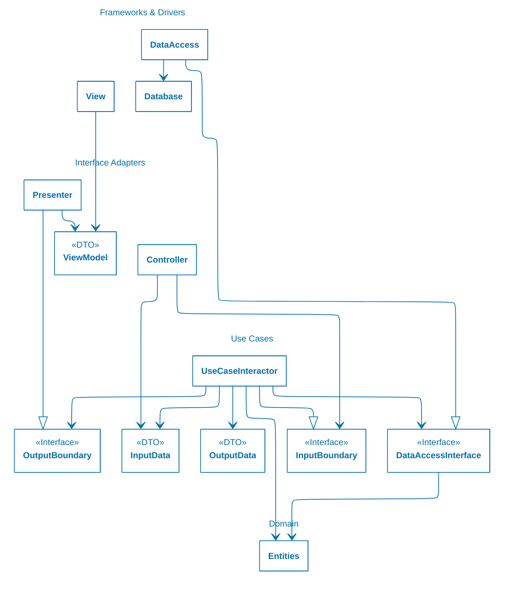

# 2 Técnicas y herramientas

## 2.7 Estilos de arquitectura

### 2.7.9 Clean Architecture

<!-- cSpell:ignore Cockburn -->

Este estilo de arquitectura es definido por Robert C. Martin en [^C]. Está
fuertemente influido por otros estilos previos como [Hexagonal
Architecture-Ports &
Adapters](https://alistair.cockburn.us/hexagonal-architecture)[^A] de Alistair
Cockburn y [Onion
Architecture](https://jeffreypalermo.com/2008/07/the-onion-architecture-part-1/)
de Jeffry Palermo[^B].

[^C]: Martin, R. C. (2012). Clean Architecture [Entrada de blog]. The Clean Code
    Blog. Disponible
    [aquí](https://blog.cleancoder.com/uncle-bob/2012/08/13/the-clean-architecture.html).
[^A]: Cockburn, A., & Garrido de Paz, J. M. (2025). Hexagonal Architecture
    Explained: How the Ports & Adapters architecture simplifies your life, and
    how to implement it, Updated 1st Ed. Humans and Technology Inc. ISBN
    979-8-9985862-0-0.
[^B]: Según Vaughn Vernon, en su libro Implementing Domain-Driven Design, ≪Onion
    Architecture≫ es simplemente un nombre desafortunado para ≪Hexagonal
    Architecture≫.

Todos estos estilos comparten ciertas características:

* Colocan el [modelo de dominio](/4_Conceptos/4_Dominio.md) —incluyendo las
  reglas de negocio— en el centro del diseño. Todo lo demás —interfaz de
  usuario, persistencia, mensajería, *frameworks*, etc.— queda en los bordes.

* El código del modelo de dominio es agnóstico respecto de los mecanismos
  técnicos. No hay HTTP, SQL, Kafka, etc.; esos detalles se ≪inyectan≫ luego
  mediante interfaces en Clean Architecture y ≪puertos≫ y ≪adaptadores≫ en
  Hexagonal Architecture.

* El código más externo puede depender del centro, pero el centro nunca depende
  de nada externo. Esa es la esencia de la ≪regla de dependencias≫ de Clean
  Architecture y de los ≪puertos≫ y ≪adaptadores≫ en Hexagonal Architecture.

* Usan el [principio de inversión de
  dependencias](https://github.com/ucudal/PII_Guias/blob/main/DIP.md) para
  evitar el acoplamiento entre capas. Esto significa que las capas se ≪conectan≫
  mediante interfaces.

En Clean Architecture el código se organiza en círculos concéntricos, donde cada
círculo representa un área de responsabilidad distinta del software. Los
elementos de código de un círculo no pueden tener referencias a elementos
ubicados en un círculo exterior; o dicho de otra forma, las dependencias pueden
ir sólo de afuera hacia adentro.

*Figura 1: Clean Architecture*. Tomado de [^C].

> **Regla de dependencias**: las dependencias de código fuente sólo pueden
> apuntar hacia adentro.

#### Capas o círculos concéntricos

En Clean Architecture típicamente se definen las siguientes capas —o círculos
concéntricos—:

* **Entidades** o reglas del negocio de la organización. Define el
  [dominio](/4_Conceptos/4_Dominio.md) y las reglas del negocio de la
  organización mediante
  [agregados](/2_Tecnicas_y_herramientas/2_08_.Patrones_de_diseno/2_08_Aggregate.md),
  [entidades](/2_Tecnicas_y_herramientas/2_08_.Patrones_de_diseno/2_08_Entity.md),
  [objetos
  valor](/2_Tecnicas_y_herramientas/2_08_.Patrones_de_diseno/2_08_Value_Object.md),
  [eventos](https://martinfowler.com/eaaDev/DomainEvent.html) y excepciones
  específicas.

  En algunas implementaciones las entidades utilizan
  [eventos](https://martinfowler.com/eaaDev/DomainEvent.html) para informar
  cuando se crean, modifican o eliminan instancias —en este sentido también
  podría ser una [arquitectura dirigida por
  eventos](/2_Tecnicas_y_herramientas/2_07_.Estilos_arquitectura/2_07_05_Event_Driven_Architecture.md).

  Las entidades tienen la responsabilidad de generar los eventos, pero es la
  capa de casos de uso la que se encarga de procesarlos.

  Esta capa no tiene referencias a ninguna otra. Algunos autores incluyen entre
  las entidades la definición de abstracciones —interfaces— para los
  [repositorios](/2_Tecnicas_y_herramientas/2_08_.Patrones_de_diseno/2_08_Repository.md)
  de los
  [agregados](/2_Tecnicas_y_herramientas/2_08_.Patrones_de_diseno/2_08_Aggregate.md).
  La implementación de estas abstracciones se proporciona en tiempo de ejecución
  mediante clases definidas en la capa de casos de uso, utilizando [inyección de
  dependencias](https://martinfowler.com/articles/injection.html), normalmente
  configuradas en la capa de *frameworks & drivers*, que es la más externa. Como
  el dominio, en principio, no usa estos repositorios, es posible declarar esas
  abstracciones tanto aquí o en la capa de casos de uso —donde realmente se
  usan—.

* **Casos de uso** o reglas de negocio de la aplicación. Define las
  funcionalidades de la aplicación, es decir, implementa la lógica de los casos
  de uso, orquestando el flujo de datos hacia y desde los objetos del dominio
  para llevar a cabo las solicitudes de los usuarios.

  En algunos implementaciones los casos de uso suelen implementarse mediante el
  patrón [Command](https://refactoring.guru/design-patterns/command) junto con
  [CQRS](/2_Tecnicas_y_herramientas/2_09_.Patrones_de_arquitectura/2_09_CQRS.md):
  el primero provee un comando para cada caso de uso y el segundo permite
  separar los comandos que sean acciones de los que sean consultas.

  La capa de casos de uso define y utiliza abstracciones —interfaces— para los
  [repositorios](/2_Tecnicas_y_herramientas/2_08_.Patrones_de_diseno/2_08_Repository.md)
  y los
  [servicios](/2_Tecnicas_y_herramientas/2_08_.Patrones_de_diseno/2_08_Service.md).

  Las implementaciones concretas de estas abstracciones se proveen en tiempo de
  ejecución mediante clases definidas en la capa de *frameworks & drivers*,
  también a través de [inyección de
  dependencias](https://martinfowler.com/articles/injection.html). La
  configuración de la inyección se suele realizar en la capa más externa de
  interfaz.

  Los eventos creados en la capa de entidades se procesan en la capa de casos de
  uso mediante un
  [mediador](https://refactoring.guru/design-patterns/mediator/csharp/example)
  abstracto. Una vez más, la implementación se encuentra en la capa de
  adaptadores de interfaz y se inyecta en tiempo de ejecución desde la capa
  externa de *frameworks & drivers*.

  La capa de casos de uso referencia exclusivamente a la capa de entidades. Aquí
  se ve claramente cómo un círculo externo puede referenciar uno más interno,
  pero no al revés.

* **Adaptadores de interfaz**. Define clases cuyas responsabilidades consisten
  en convertir datos en el formato utilizado por *frameworks* web o de interfaz
  de usuario y bases de datos en las capas exteriores al formato conveniente
  para entidades y casos de uso en las capas interiores —y viceversa—.

  Los controladores o *input translator* convierten datos recibidos desde el
  exterior —por ejemplo, un JSON que viene como *payload* en una solicitud HTTP—
  al formato utilizado por casos de uso —por ejemplo, los parámetros de un
  comando o un
  [DTO](https://martinfowler.com/eaaCatalog/dataTransferObject.html)-.

  Los presentadores o *output translator* convierten datos retornados por los
  casos de uso al formato necesario para mostrar al exterior —por ejemplo, un
  [*view model*](https://martinfowler.com/eaaDev/PresentationModel.html)
  consumido por la interfaz de usuario—.

  Las pasarelas o *gateways* hacen algo análogo pero con los servicios externos
  —por ejemplo, bases de datos, API REST, etc.—. Esto incluye la implementación
  de las abstracciones —interfaces— definidas en la capa de casos de uso:
  [repositorios](/2_Tecnicas_y_herramientas/2_08_.Patrones_de_diseno/2_08_Repository.md),
  [servicios](/2_Tecnicas_y_herramientas/2_08_.Patrones_de_diseno/2_08_Service.md)
  y [mediadores](https://refactoring.guru/design-patterns/mediator).

  Por último, esta capa tiene también la configuración de los *frameworks* de
  persistencia, mensajería, *logging*, servicios externos, etc.

  Esta capa de adaptadores de interfaz hace referencia exclusivamente a la capa
  de aplicación, reforzando que la dependencia es siempre de un círculo externo
  hacia uno interno.

* ***Frameworks & Drivers***. En esta capa se define la interfaz con el mundo
  exterior. Puede tratarse de una API —por ejemplo, HTTP/REST o gRPC— o una
  interfaz de usuario —web, móvil, escritorio, etc.—.

  La [inyección de
  dependencias](https://martinfowler.com/articles/injection.html) en tiempo de
  ejecución se configura normalmente en esta capa durante el *bootstrap* de la
  aplicación.

  Esta capa referencia tanto la capa de aplicación como la de infraestructura
  —y, en algunos casos, también directamente la de dominio—, siempre respetando
  la regla de que las dependencias apuntan hacia el centro de los círculos.

#### Cruce de fronteras y transferencia de datos

Para mantener el desacoplamiento entre capas, Clean Architecture establece
reglas estrictas sobre cómo viaja la información a través de sus límites:

* **Uso de objetos de transferencia de datos o
  [DTO](https://martinfowler.com/eaaCatalog/dataTransferObject.html)**. Los
  datos que cruzan los límites de una capa deben ser estructuras de datos
  simples, planas e inmutables, o tipos primitivos. Esto aplica tanto a las
  solicitudes como a las respuestas —por ejemplo, la capa de interfaz puede usar
  el patrón [Command](https://refactoring.guru/design-patterns/command) para
  enviar solicitudes a la capa de aplicación—.

* **Aislamiento de entidades y estructuras de datos**. Bajo ninguna
  circunstancia deben salir
  [entidades](../2_08_.Patrones_de_diseno/2_08_Entity.md) del dominio ni objetos
  del [ORM](https://en.wikipedia.org/wiki/Object–relational_mapping) o base de
  datos hacia una capa exterior. De esta forma se evita, por ejemplo, que el
  dominio se modifique por cambios en la base de datos en la capa de
  infraestructura, o porque cambió el diseño de una pantalla en la interfaz.

* **Separación del flujo de control y dependencias**. En muchos casos, el flujo
  de ejecución necesita enviar datos desde un círculo interior hacia uno
  exterior —por ejemplo, cuando un caso de uso le pasa información a la interfaz
  de usuario—. Para lograrlo sin romper la regla de dependencias, se utiliza el
  [principio de inversión de
  dependencias](https://github.com/ucudal/PII_Guias/blob/main/DIP.md): el caso
  de uso define una interfaz de salida —`Output port`—, y un componente externo
  —`Presenter` o `ViewModel Builder`— se encarga de implementarla y dar formato
  a los datos para la interfaz.

Para que vean cómo funciona esto analicemos el diagrama de clases en la [Figura
2](#figura-2), a continuación:

*Figura 2: Escenario típico en Clean Architecture.* Basado en [^D].

[^D]: Martin, R. C. (2018). Clean Architecture: A Craftsman's Guide to Software
    Structure and Design (Robert C. Martin Series).  Pearson Education.

El diagrama de la [Figura 2](#figura-2) ilustra una situación típica de una
aplicación web que trabaja con una base de datos. El servidor web reúne los
datos que ingresa el usuario y se los entrega al `Controller`. El `Controller`
encapsula esos datos en un objeto DTO sencillo y lo envía a través de la
interfaz `InputBoundary`, al `UseCaseInteractor`. Este `Interactor` interpreta
la información recibida y la utiliza para coordinar la interacción entre las
`Entities`. Además, se apoya en la `DataAccessInterface` para cargar en memoria,
desde la base de datos, los datos que esas `Entities` necesitan.

<!-- cSpell:ignore renderizar -->

Cuando termina el procesamiento, el `UseCaseInteractor` toma la información
resultante de las `Entities` y construye un objeto `OutputData`, nuevamente como
un DTO. Luego, `OutputData` se entrega al `Presenter` por medio de la interfaz
`OutputBoundary`. El rol del `Presenter` es transformar esos datos de salida en
un formato apto para la presentación: el `ViewModel`, que no es más que otro
DTO. El `ViewModel` contiene principalmente cadenas de texto y banderas que la
`View` usará para renderizar la información.

<!-- cSpell:ignore volcarlos -->

Aunque `OutputData` puede incluir fechas u otros tipos enriquecidos, el
`Presenter` se encarga de poblar el `ViewModel` con las cadenas ya formateadas
de forma adecuada para el usuario. Lo mismo aplica a valores monetarios u otros
datos de negocio. En el `ViewModel` también se incluyen los textos de los
botones y elementos de menú, así como las banderas que le indican a la `View` si
esos controles deben mostrarse deshabilitados. De esta manera, la `View` queda
reducida casi por completo a tomar los datos del `ViewModel` y volcarlos en la
página HTML.

Por último, fíjense en la orientación de las dependencias: todas las
dependencias que cruzan los límites de capa lo hacen apuntando hacia el
interior, respetando la regla de dependencias.

> [!TIP]
>
> Hay una demo de Clean Architecture en .NET
> [aquí](https://github.com/ucudal/ANDIS_CleanArchitecture_Demo) que te
> recomendamos consultar.
