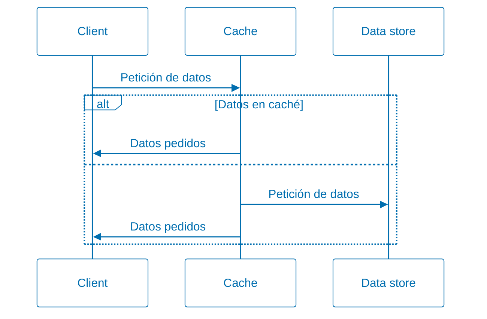

```mermaid
%%{
  init: {
    'theme': 'base',
    'themeVariables': {
       'mainBkg': 'transparent',
      'primaryColor': 'transparent',
      'primaryTextColor': '#006EAF',
      'primaryBorderColor': '#006EAF',
      'lineColor': '#006EAF',
      'secondaryColor': '#006100',
      'fontFamily':'Helvetica',
      'fontSize':'8px'
    }
  }
}%%
sequenceDiagram
    Participant Client
    Participant Cache
    Participant Data store
    Client->>Cache: Petición de datos
    alt Datos en caché
    Cache->>Client: Datos pedidos
    else
    Cache->>Data store: Petición de datos
    Cache->>Client: Datos pedidos
    end
```
