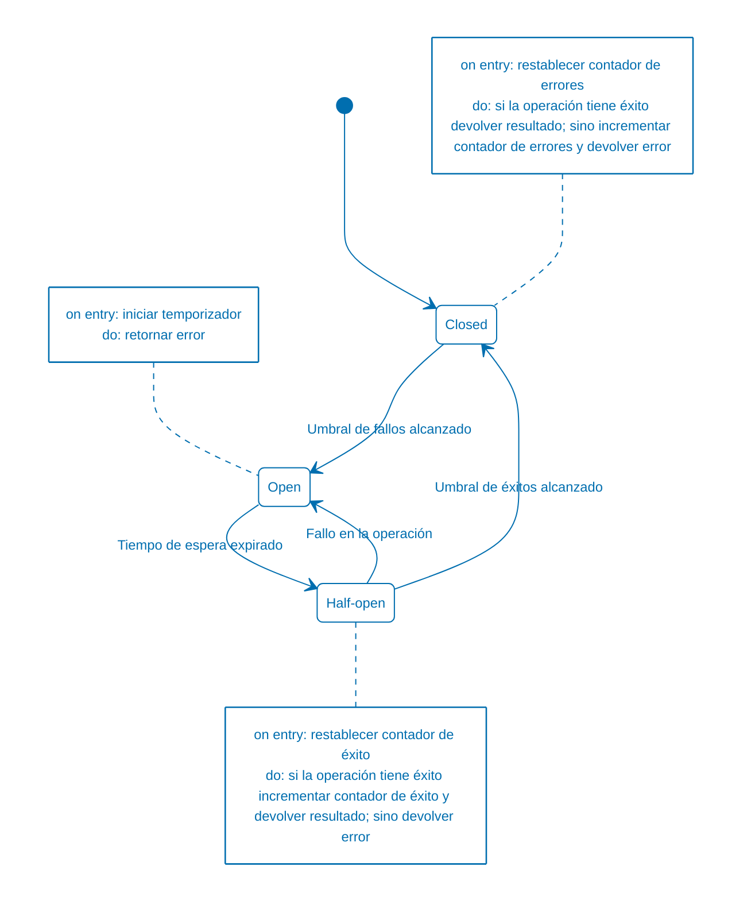

```mermaid
%%{
  init: {
    'theme': 'base',
    'themeVariables': {
      'mainBkg': 'transparent',
      'primaryColor': 'transparent',
      'primaryTextColor': '#006EAF',
      'primaryBorderColor': '#006EAF',
      'lineColor': '#006EAF',
      'secondaryColor': '#006EAF',
      'edgeLabelBackground': 'transparent',
      'fontFamily':'Helvetica',
      'fontSize':'12px',
      'noteBkgColor':'transparent',
      'noteTextColor': '#006EAF',
      'noteBorderColor':'#006EAF'
    }
  }
}%%
stateDiagram-v2
    [*] --> Closed
    Closed --> Open: Umbral de fallos alcanzado
    Open --> Half‑open: Tiempo de espera expirado
    Half‑open --> Open: Fallo en la operación
    Half‑open --> Closed: Umbral de éxitos alcanzado

    note left of Closed
        on entry: restablecer contador de errores
        do: si la operación tiene éxito devolver resultado; sino incrementar contador de errores y devolver error
    end note
    note right of Half‑open
        on entry: restablecer contador de éxito
        do: si la operación tiene éxito incrementar contador de éxito y devolver resultado; sino devolver error
    end note
    note left of Open
        on entry: iniciar temporizador
        do: retornar error
    end note
```
