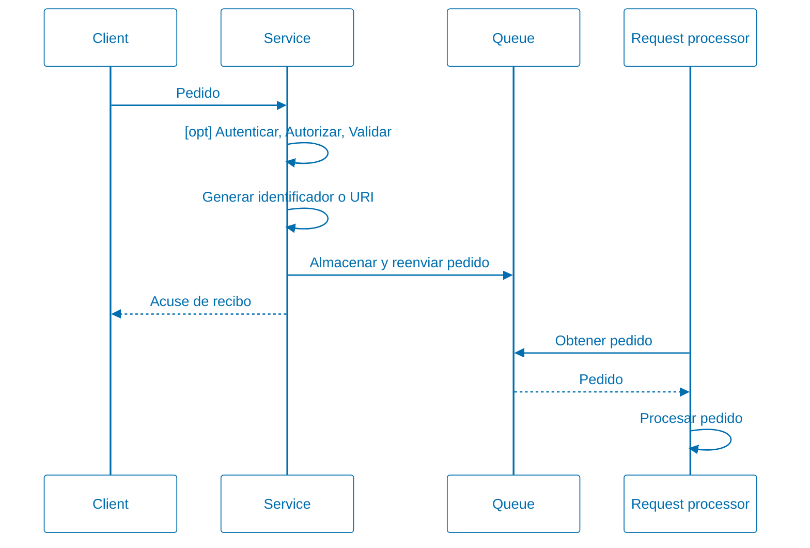

```mermaid
%%{
  init: {
    'theme': 'base',
    'themeVariables': {
       'mainBkg': 'transparent',
      'primaryColor': 'transparent',
      'primaryTextColor': '#006EAF',
      'primaryBorderColor': '#006EAF',
      'lineColor': '#006EAF',
      'secondaryColor': '#006100',
      'fontFamily':'Helvetica',
      'fontSize':'8px'
    }
  }
}%%
sequenceDiagram
    Participant Client
    Participant Service
    Participant Queue
    Participant Request processor

    Client->>Service: Pedido

    Service->>Service: [opt] Autenticar, Autorizar, Validar

    Service->>Service: Generar identificador o URI
    Service->>Queue: Almacenar y reenviar pedido
    Service-->>Client: Acuse de recibo

    Request processor->>Queue: Obtener pedido
    Queue-->>Request processor: Pedido
    Request processor->>Request processor: Procesar pedido
```