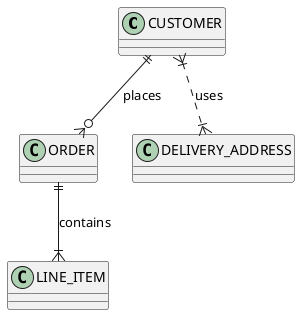
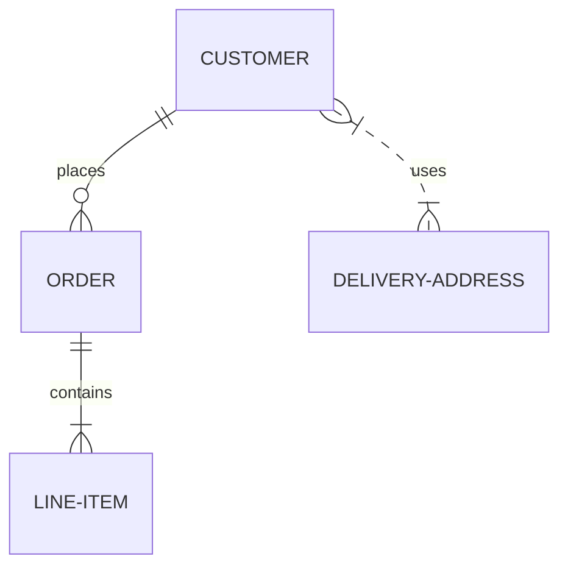

# 2 Técnicas y herramientas

## 2.11 Modelado y dibujo

Las herramientas de modelado y dibujo permiten construir modelos y diagramas
como los incluidos en [modelos de estructura](./2_3_.Modelos_de_estructura.md),
[modelos de comportamiento](./2_4_.Modelos_de_comportamiento.md), o
[arquitectura](./2_2_.Arquitectura.md).

Una herramienta de modelado permite definir primero un modelo —por ejemplo un
modelo de [dominio](/4_Conceptos/4_Dominio.md)— y luego generar a partir de ese
modelo diferentes diagramas —por ejemplo [diagramas de
clases](./2_3_1_Diagramas_de_clases_UML.md). Para cambiar las entidades que
aparecen en el diagrama, o alguna de sus propiedades o relaciones, es necesario
modificar primero el modelo y volver a generar los diagramas. De esta forma es
más simple tener los diagramas consistentes entre sí, porque la sincronización
la realiza la herramienta a partir de un único modelo.

> [!NOTE]
> Ejemplos de este tipo de herramientas utilizadas en ambientes corporativos
> incluyen —la lista obviamente es incompleta— [Sparx Enterprise
> Architect](https://sparxsystems.com) o [IBM Rational® Software Architect
> Designer](https://www.ibm.com/products/rational-software-architect-designer).
> Para uso personal existe una versión [Visual Paradigm Community
> Edition](https://www.visual-paradigm.com/download/community.jsp) que puedes
> utilizar para tus entregas.

Una herramienta de dibujo permite crear directamente los diagramas. Para cambiar
las entidades, propiedades o relaciones que aparecen en el diagrama, basta con
modificar ese diagrama. Aunque es más simple de esta forma, requiere trabajo
adicional mantener la consistencia entre los diagramas. Al no existir un único
modelo, los diagramas adicionales que sean necesarios tendrán que ser creados a
mano.

> [!NOTE]
> [Draw.io](https://www.drawio.com) es una herramienta de este tipo de
> probablemente conozcas[^1]. Otra herramienta muy conocida —disponible para
> Windows— es [Microsoft
> Visio](https://portal.azure.com/#view/Microsoft_Azure_Education/EducationMenuBlade/~/software).
> Puedes acceder a esa herramienta a través de la suscripción que ya tienes a
> Azure como estudiante de UCU.

[^1]: Varios de los diagramas `.svg` que aparecen en páginas de este sitio son
    exportados desde Draw.io a partir de los archivos `.drawio` correspondientes
    en [esta carpeta](/diagrams/). Los archivos `.drawio` están bajo control de
    configuración —son archivos de texto después de todo— pero nosotros los
    editores tenemos que acordarnos de volver a exportar y generar el archivo
    `.svg` correspondiente cada vez que los modificamos.

No hay una herramienta mejor que otra, sino una herramienta mas útil que otra
según el caso. Algunos proyectos pueden requerir múltiples diagramas que
evolucionan en el tiempo y querrás mantenerlos sincronizados con poco esfuerzo;
en este caso una herramienta de modelado puede ser más útil que una herramienta
de dibujo. En otros casos querrás simplemente trasladar una idea de diseño y
harás un diagrama a mano alzada en un pizarrón. O querrás hacer un diagrama para
mostrar algún aspecto específico de tu software y embeberlo en la documentación.

> [!TIP]
> En línea con lo anterior, puedes ver que Martin Fowler menciona [tres
> formas](https://martinfowler.com/bliki/UmlMode.html) de usar un lenguaje de
> modelado como [UML](https://www.uml.org) que pueden ser soportadas por
> diferentes tipos de herramientas: como
> [croquis](https://martinfowler.com/bliki/UmlAsSketch.html), como
> [plano](https://martinfowler.com/bliki/UmlAsBlueprint.html) y como [lenguaje
> de
> programación](https://martinfowler.com/bliki/UmlAsProgrammingLanguage.html).

Con la adopción de metodologías ágiles que [favorecen la comunicación sobre la
documentación](https://agilemanifesto.org), el uso de herramientas de modelado
ha ido dando lugar a herramientas que permiten hacer los diagramas utilizando
[lenguajes específicos de dominio](https://martinfowler.com/dsl.html) utilizando
cualquier editor de texto plano —aunque también existen *plugins* para editores
de código y editores online—. En este caso los diagramas se escriben en un
lenguaje con una sintaxis particular y se convierten en imágenes usando
herramientas.

Un ejemplo de estas herramientas es [PlantUML](https://plantuml.com/). A pesar
de lo que podría sugerir el nombre, incluye varios tipos de diagramas que no son
UML, además de todos los de UML. Tiene un [editor
online](https://www.plantuml.com/plantuml/uml/) de diagramas y es posible
incluir código PlantUML directamente en documentos
[Markdown](https://daringfireball.net/projects/markdown/) —Markdown es el
lenguaje en el que está escrito este documento que estás viendo—. Por ejemplo,
este bloque de código —que está incluido tal como lo ves en este documento, pero
dentro de un [*fenced code
block*](https://www.markdownguide.org/extended-syntax/#fenced-code-blocks)—, da
lugar al diagrama que está debajo:

```code
@startuml
CUSTOMER ||--o{ ORDER : places
ORDER ||--|{ LINE_ITEM : contains
CUSTOMER }|..|{ DELIVERY_ADDRESS : uses
@enduml
```



Otro ejemplo es [Mermaid](https://mermaid.js.org/). También existe un [editor
online](https://www.mermaidchart.com/) de diagramas escritos en Mermaid, y
también es posible incluir el código de los diagramas directamente en documentos
Markdown:

```
erDiagram
    CUSTOMER ||--o{ ORDER : places
    ORDER ||--|{ LINE-ITEM : contains
    CUSTOMER }|..|{ DELIVERY-ADDRESS : uses
```



