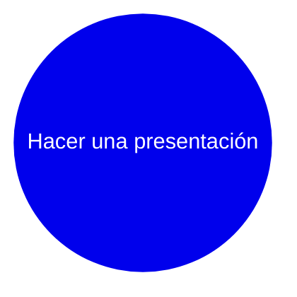
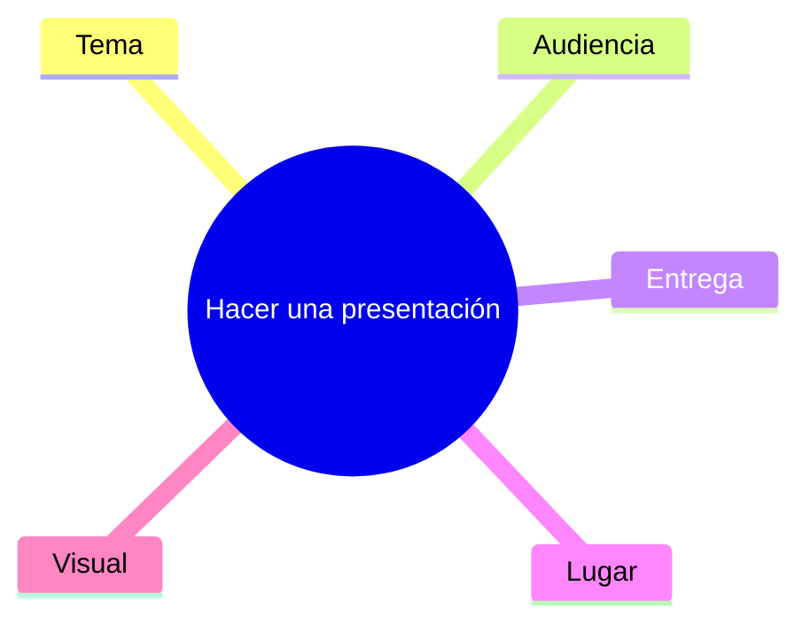
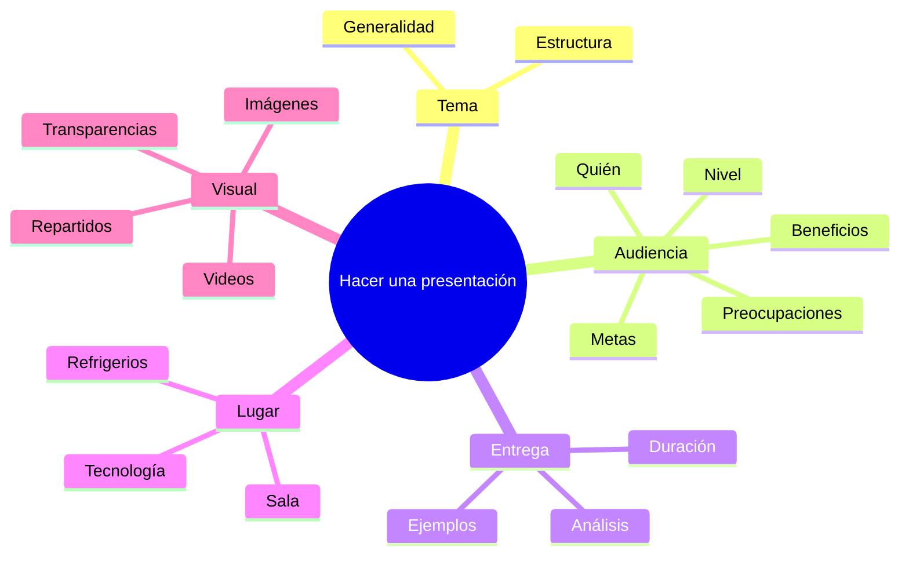
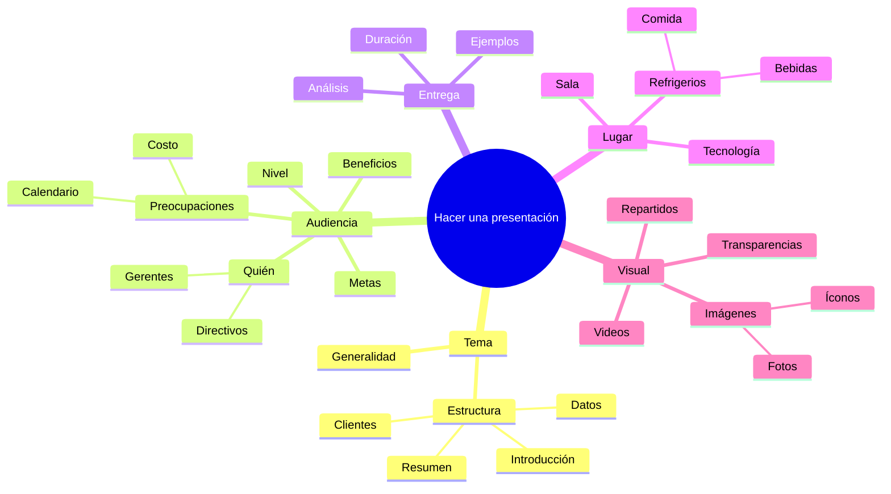

# 2 Técnicas y herramientas

## 2.1 Relevamiento

### 2.1.1 Mapas mentales

Los [mapas mentales](https://en.wikipedia.org/wiki/Mind_map) son una herramienta
poderosa para apoyar el aprendizaje, mejorar el registro de información, mostrar
cómo se relacionan diferentes hechos e ideas, y potenciar la resolución creativa
de problemas.

## Qué son los mapas mentales

Los mapas mentales fueron popularizados por el autor y consultor Tony Buzan.
Utilizan una estructura bidimensional en lugar del formato de lista utilizado
habitualmente para tomar notas.

Esto facilita recordar la información, ya que se mantiene en un formato que
encontramos fácil de recordar y rápido de revisar.

Un buen mapa mental muestra la "forma" del tema, la importancia relativa de los
puntos individuales y las formas en que los hechos se relacionan entre sí. La
[investigación](https://www.sciencedirect.com/science/article/abs/pii/S1472811713000426)
muestra que esto es particularmente beneficioso al tratar con información
compleja, como durante la planificación empresarial, el desarrollo de
estrategias, o el proceso de relevamiento de requerimientos.

Los mapas mentales son más compactos que las notas convencionales y a menudo
ocupan solo una hoja de papel. Esto ayuda a hacer asociaciones y generar nuevas
ideas. También permite agregar nueva información fácilmente, incluso a un mapa
mental previamente dibujado. El mapa mental también puede ayudar a desglosar
proyectos o temas grandes en partes manejables, para que se puedan manejar de
manera efectiva, evitando sentirte abrumado y sin olvidar algo importante.

## Para qué usar los mapas mentales

Los mapas mentales son útiles para:

- Tormenta de ideas -tanto individualmente como en grupo-.
- Resumir información.
- Tomar notas.
- Consolidar información de diferentes fuentes.
- Resolver problemas complejos.
- Presentar información de manera clara.
- Estudiar y memorizar información.

Los mapas mentales también son buenos para refrescar la información en la cabeza:
cuando se memoriza la forma y estructura de un mapa mental, a menudo se pueden
obtener las pistas que necesitas para recordar la información que contiene con
solo echar un vistazo rápido al mapa.

Realmente es posible ser inventivo con los mapas mentales, por lo que son
excelentes para aumentar la creatividad también. Cuando se incluyen colores,
imágenes o dibujos, ¡incluso pueden parecer una obra de arte!

_[Fuente](https://www.tonybuzan.edu.sg/about/mind-maps/)_

_[Fuente](https://www.tonybuzan.edu.sg/about/mind-maps/)_

## Cómo dibujar un mapa mental básico

Para dibujar un mapa mental:

**Paso 1**. Escribir el título del tema o proyecto que se va a representar en el
centro de una página y dibujar un círculo alrededor, como se muestra en la
figura debajo -este ejemplo muestra un mapa mental de las acciones necesarias
para realizar una presentación exitosa-.

_[Fuente](https://www.mindtools.com/ahlezc4/mind-maps)_

**Paso 2**. Dibujar líneas desde este círculo pensando en subtítulos del tema o
en datos o tareas importantes que se relacionen con el tema. Etiquetar estas
líneas con los subtítulos, como se muestra en la figura debajo.

_[Fuente](https://www.mindtools.com/ahlezc4/mind-maps)_

**Paso 3**. Sumergirse más en el tema para descubrir el siguiente nivel de
información -subtemas relacionados, tareas o datos, por ejemplo-. Luego,
vincular estos con los subtítulos relevantes, como en la figura debajo.

_[Fuente](https://www.mindtools.com/ahlezc4/mind-maps)_

**Paso 4**. Repetir el proceso para el siguiente nivel de datos, tareas e ideas.
Dibujar líneas desde los encabezados apropiados y etiquetarlos, como se muestra
en la figura de abajo.

_[Fuente](https://www.mindtools.com/ahlezc4/mind-maps)_

**Paso 5**. A medida que se descubre nueva información o aparecen tareas
adicionales, agregarlas a tu mapa mental en los lugares apropiados.

Un mapa mental completo puede tener líneas principales que irradian en todas
direcciones desde el centro, con subtemas ramificándose de estas líneas como
ramas y ramitas del tronco de un árbol. No es necesario preocuparse por la
estructura que se produce, esta evolucionará por sí sola.

_[Fuente](https://www.mindtools.com/ahlezc4/mind-maps)_

💡 **Consejo**: Si bien dibujar mapas mentales a mano es apropiado en muchos casos,
herramientas y aplicaciones como [Draw.io](https://drawio-app.com/blog/increase-productivity-with-mind-maps-in-draw-io/),
[Visio](https://support.microsoft.com/en-us/office/five-great-tools-for-making-brainstorming-diagrams-in-visio-92d2505b-8187-4134-b1a9-16e7a20720e8)
-todos los estudiantes y docentes tiene acceso a Visio a través de
[Azure for Education](https://portal.azure.com/#view/Microsoft_Azure_Education/EducationMenuBlade/~/software)-,
[Mindmeister](https://www.mindmeister.com/), o incluso [Mermaid](https://mermaid.js.org/syntax/mindmap.html)
-que hemos usado en este documento- pueden mejorar el proceso al ayudar a
producir mapas mentales de alta calidad, que luego se pueden editar o revisar
fácilmente.

## Cómo usar mapas mentales de manera efectiva

Una vez entendido cómo tomar notas en formato de mapa mental, es posible
desarrollar otras convenciones para llevarlas más lejos. Las siguientes
sugerencias pueden ayudar a obtener el máximo provecho de los mapas mentales:

1. Usar palabras simples o frases sencillas: En los mapas mentales, palabras
   simples y frases cortas y significativas pueden transmitir el mismo significado
   de manera más potente. Las palabras en exceso solo desordenan un mapa mental.

2. Usar letra de molde: Será más fácil de leer que la escritura cursiva o
manuscrita.

3. Usar color para separar ideas diferentes: El color puede ayudar a mostrar la
   organización del tema. También puede hacer que el mapa mental sea un documento
   más atractivo y ayudar a visualizar las diferentes secciones para recordarlas
   en el futuro.

4. Usar símbolos e imágenes: Las imágenes pueden ayudar a recordar información
   de manera más efectiva que las palabras, así que es bueno usar símbolos o
   imágenes que signifiquen algo para la audiencia o el autor. Es posible usar
   [emojis](https://unicode.org/emoji/charts/full-emoji-list.html) o bibliotecas
   de fotos como [iStock](https://www.istockphoto.com/es) para obtener imágenes de
   manera económica.

5. Utilizar conexiones cruzadas: La información en una parte de un mapa mental
   puede relacionarse con otra parte, así que se puede dibujar líneas para mostrar
   estas conexiones cruzadas. Esto ayudará a mostrar cómo una parte del tema afecta
   a otra.

## Resumen

El método de mapas mentales es una poderosa forma de tomar notas que resalta
datos importantes y muestra la estructura general de un tema, así como la
importancia relativa de sus partes.

Estos mapas son útiles para el pensamiento creativo, haciendo conexiones entre
ideas y resolviendo problemas.

Para usar los mapas mentales de manera efectiva, es recomendable imprimir las
palabras, usar diferentes colores y añadir símbolos e imágenes para estimular el
pensamiento creativo. Experimentar con mapas mentales en la investigación o toma
de notas puede resultar muy beneficioso y placentero.

## Referencias

- [MindTools: Mind Maps](https://www.mindtools.com/ahlezc4/mind-maps)
- [Mind Maps: Tony Buzan Learning Center](https://www.tonybuzan.edu.sg/about/mind-maps/)
- [How to Mind Map with Tony Buzan](https://www.youtube.com/watch?v=u5Y4pIsXTV0)
- Buzan, T., and Buzan, B. (1996). [The Mind Map Book: How to Use Radiant
Thinking to Maximize Your Brains Untapped Potential](https://www.amazon.com/Mind-Map-Book-Thinking-Potential/dp/0452273226).
New York: Plume.
