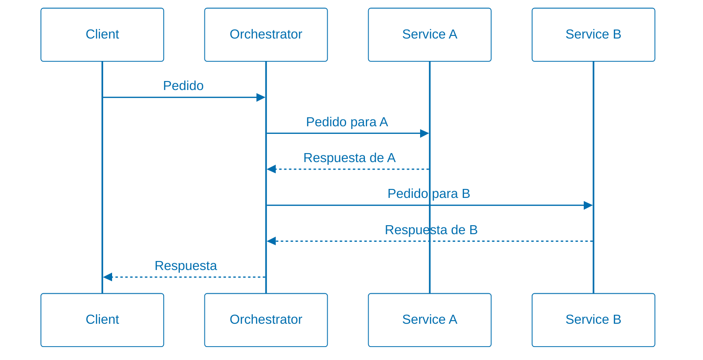
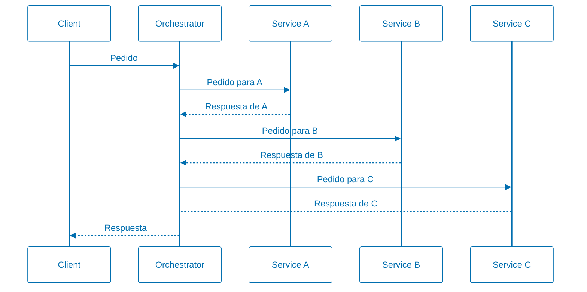

Con coreografía:

```mermaid
%%{
  init: {
    'theme': 'base',
    'themeVariables': {
       'mainBkg': 'transparent',
      'primaryColor': 'transparent',
      'primaryTextColor': '#006EAF',
      'primaryBorderColor': '#006EAF',
      'lineColor': '#006EAF',
      'secondaryColor': '#006100',
      'fontFamily':'Helvetica',
      'fontSize':'8px'
    }
  }
}%%
sequenceDiagram
    Participant Client
    Participant Orchestrator
    Participant Service A
    Participant Service B

    Client->>Orchestrator: Pedido
    Orchestrator->>Service A: Pedido para A
    Service A-->>Orchestrator: Respuesta de A
    Orchestrator->>Service B: Pedido para B
    Service B-->>Orchestrator: Respuesta de B
    Orchestrator-->>Client: Respuesta
```

Con orquestación:

```mermaid
%%{
  init: {
    'theme': 'base',
    'themeVariables': {
       'mainBkg': 'transparent',
      'primaryColor': 'transparent',
      'primaryTextColor': '#006EAF',
      'primaryBorderColor': '#006EAF',
      'lineColor': '#006EAF',
      'secondaryColor': '#006100',
      'fontFamily':'Helvetica',
      'fontSize':'8px'
    }
  }
}%%
sequenceDiagram
    Participant Client
    Participant Orchestrator
    Participant Service A
    Participant Service B
    Participant Service C

    Client->>Orchestrator: Pedido
    Orchestrator->>Service A: Pedido para A
    Service A-->>Orchestrator: Respuesta de A
    Orchestrator->>Service B: Pedido para B
    Service B-->>Orchestrator: Respuesta de B
    Orchestrator->>Service C: Pedido para C
    Service C-->Orchestrator: Respuesta de C
    Orchestrator-->>Client: Respuesta
```