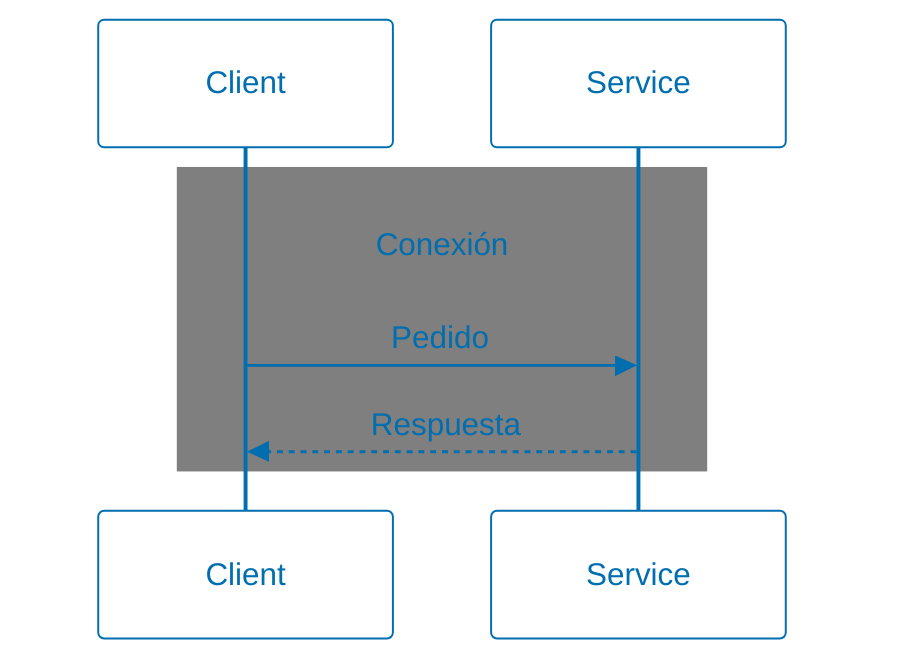

# 2 Técnicas y herramientas

## 2.9 Patrones de arquitectura

### Request/Response

>  Problema 
> ¿Cuál es la forma más simple para que un servicio procese un pedido y provea
> un resultado?

>  Solución 
> Procesar los pedidos cuando son recibidos y retornar los resultados en la
> misma conexión con el cliente

Este documento está basado en [^1].

[^1]: Daigneau, R.; Robinson, I. (2012). Service Design Patterns. Addison-Wesley.

