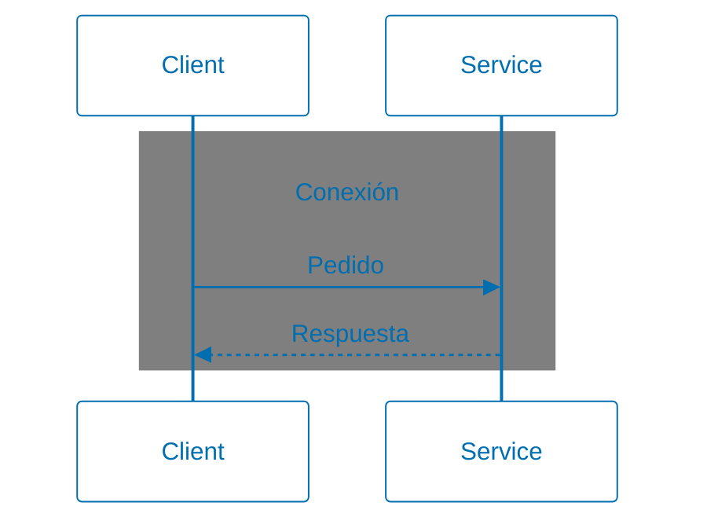

```mermaid
%%{
  init: {
    'theme': 'base',
    'themeVariables': {
       'mainBkg': 'transparent',
      'primaryColor': 'transparent',
      'primaryTextColor': '#006EAF',
      'primaryBorderColor': '#006EAF',
      'lineColor': '#006EAF',
      'secondaryColor': '#006100',
      'fontFamily':'Helvetica',
      'fontSize':'8px',
      'noteBkgColor':'transparent',
      'noteTextColor':'#006EAF'
    }
  }
}%%
sequenceDiagram
    Participant Client
    Participant Service

    rect rgba(0, 0, 0, 0.5)
        note over Client, Service: Conexión
        Client->>Service: Pedido
        Service-->>Client: Respuesta
    end
```