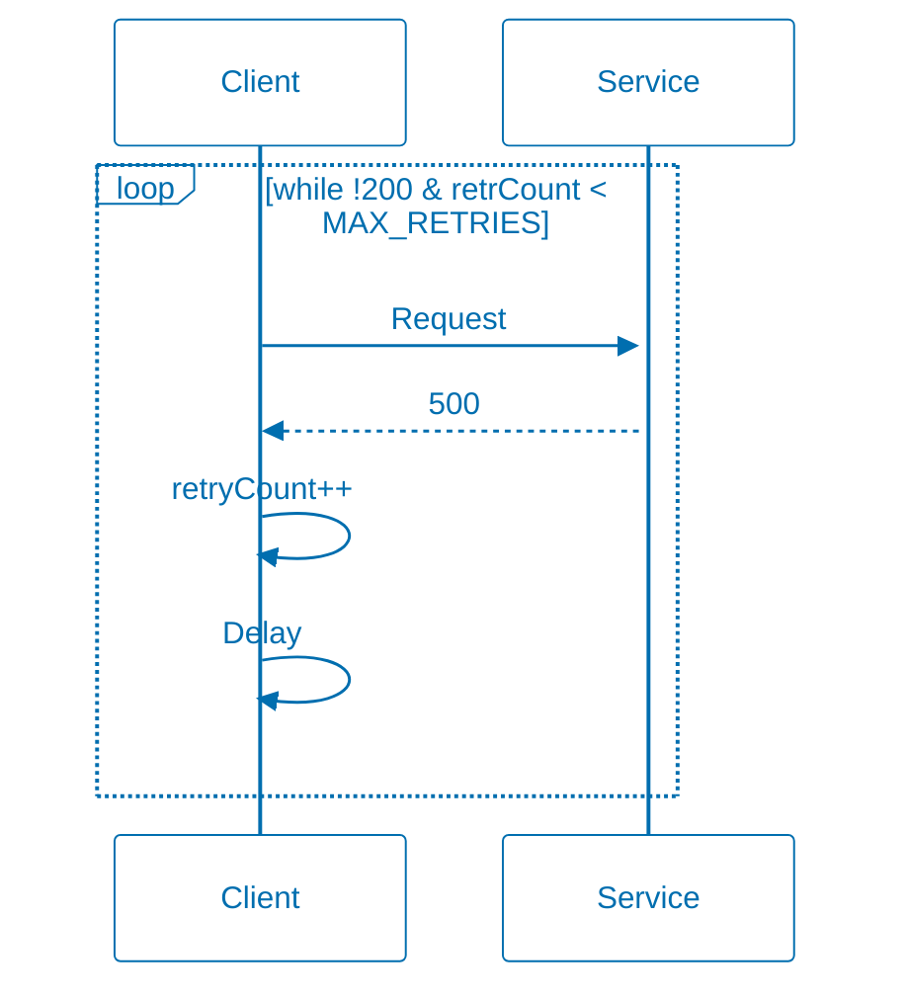

```mermaid
%%{
  init: {
    'theme': 'base',
    'themeVariables': {
      'mainBkg': 'transparent',
      'primaryColor': 'transparent',
      'primaryTextColor': '#006EAF',
      'primaryBorderColor': '#006EAF',
      'lineColor': '#006EAF',
      'secondaryColor': '#006EAF',
      'edgeLabelBackground': 'transparent',
      'fontFamily':'Helvetica',
      'fontSize':'12px'
    }
  }
}%%
sequenceDiagram
    loop while !200 & retrCount < MAX_RETRIES
        Client->>+Service: Request
        Service-->>Client: 500
        Client->>Client: retryCount++
        Client->>Client: Delay
    end
```