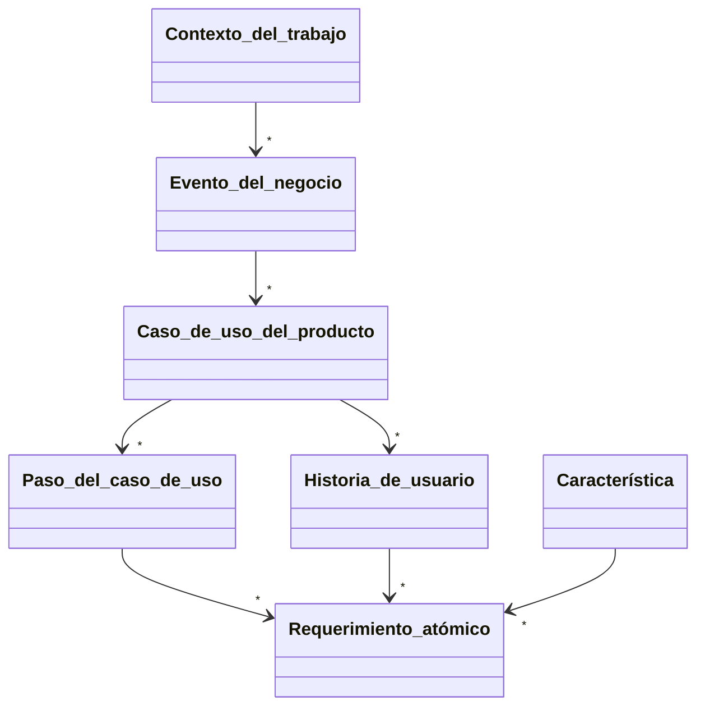

# 4. Conceptos

## Jerarquía de requerimientos

El [contexto del
trabajo](/4_Conceptos/4_Trabajo_y_area_de_trabajo.md) es la
declaración de requisitos de más alto nivel; se descompone en el siguiente
nivel, los [eventos del negocio](/4_Conceptos/4_Evento_del_negocio.md). El nivel
debajo de los eventos del negocio comprende los [casos de uso del
producto](/4_Conceptos/4_Caso_de_uso_del_producto.md), cada uno de los cuales se
descompone en una serie de pasos de casos de uso del producto. El nivel más bajo
incluye los [requerimientos
atómicos](/3_Plantillas/3_1_Requerimiento_atomico.md), cada uno de los cuales se
puede rastrear siguiendo esta jerarquía. Los diagramas de actividad y las
historias de usuarios también se utilizan para agrupar requerimientos atómicos.
Las características son una agrupación que suelen utilizar las partes
interesadas en el marketing o la planificación de versiones de productos. Tomado
de [^1].

Figura tomada de [^1].

[^1]: Robertson, S. & Robertson, J. (2012). Mastering the Requirements Process:
Getting Requirements Right, 3rd Edition. Addison-Wesley Professional.
