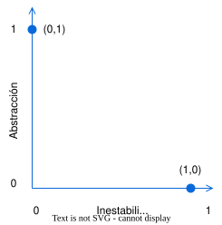
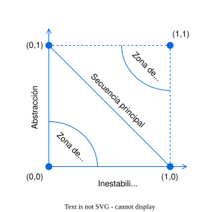

# 4 Conceptos

## SAP o *Stable Abstractions Principle*

Algunas piezas del software no van a variar frecuentemente; estas piezas
representan decisiones de alto nivel sobre arquitectura y políticas. No es
deseable que estas decisiones de arquitectura y del negocio sean volátiles, por
lo que deberían estar en [componentes estables](./4_SDP.md) —con $I = 0$—. Los
componentes inestables —con $I = 1$— deberían contener piezas de software que
sean volátiles, es decir, que se puedan cambiar fácil y rápidamente.

Pero si estas piezas de alto nivel están en componentes estables, van a ser
difíciles de cambiar. Esto puede resultar en una arquitectura inflexible.

¿Cómo puede un componente[^1] que es máximamente estable —con $I = 0$— ser lo
suficientemente flexible como para soportar cambios? La respuesta está en el
[principio
abierto—cerrado](https://github.com/ucudal/PII_Guias/blob/main/OCP.md), u OCP.
Este principio dice que es posible y deseable que las clases sean lo
suficientemente flexibles como para ser extendidas sin que tengan que ser
modificadas. Las clases abstractas —o las interfaces, e incluso los tipos
genéricos— cumplen con este principio.

[^1]: En esta definición, ≪componente≫ significa ≪unidad de despliegue≫, por
    ejemplo, una DLL, un JAR, etc.; comparar con esta otra definición de
    [componente](./4_Componente.md).

El principio de abstracciones estables, o SAP por *stable abstractions
principle* en inglés, fue introducido por Robert C. Martin[^2][^3].

[^2]: Martin, R. C. (1997). Stability. The C++ Report. Recuperado de Object
    Mentor [aquí](https://objectmentor.com/resources/articles/stability.pdf).

[^3]: Martin, R. C. (2018). Clean architecture: A craftsman’s guide to software
    structure and design. Pearson.

El principio dice:

> Los componentes que sean máximamente estables deben ser máximamente
> abstractos. Los componentes inestables deben ser concretos. La abstracción de
> un componente debe ser proporcional a su estabilidad.

El principio establece una relación entre la estabilidad y el nivel de
abstracción de un componente. Por un lado, plantea que un componente estable
debería ser también abstracto, de modo que su estabilidad no se convierta en un
obstáculo para su extensión. Por otro lado, sostiene que un componente inestable
debería ser concreto, ya que precisamente su inestabilidad facilita la
modificación del código específico que contiene.

Combinando el SAP y el [SDP](./4_SDP.md) llegamos al [principio de inversión de
dependencias](https://github.com/ucudal/PII_Guias/blob/main/DIP.md), o DIP, para
componentes. El SDP nos dice que las dependencias deben ir en dirección de la
estabilidad y el SAP nos dice que la estabilidad implica abstracción, por lo que
las dependencias deben ir en dirección de la abstracción.

El DIP aplica a tipos que bien son abstractos o bien son concretos
—en este contexto, son tipos abstractos las clases abstractas, las
interfaces y los tipos genéricos—. En cambio, tanto el SDP como el SAP
aplican a componentes, que pueden ser parcialmente abstractos o parcialmente
concretos.

¿Cómo medimos la abstracción? La métrica $A$ de abstracción de un componente se
define como:

$A = N_a / N_c$

donde $N_a$ es el número de tipos abstractos y $N_c$ es el total de tipos.

La métrica $A$ varía entre 0 y 1. Cuando vale 0 implica que el componente no
tiene ningún tipo abstracto; cuando vale 1 es porque todos los tipos que
contiene son abstractos.

Una vez definida esta métrica, es posible relacionarla con la métrica $I$ de
[estabilidad](./4_SDP.md), mediante una gráfica en la que aparece $A$ en el eje
vertical e $I$ en el eje horizontal, tal como se muestra en la siguiente [Figura
1](#figura-1).

*Figura 1: La gráfica de I/A.*

Los dos puntos en la gráfica de esa [Figura 1](#figura-1) muestran los casos de
componentes "ideales": máximamente estables y máximamente abstractos $(0,1)$, y
máximamente inestables y máximamente concretos $(1,0)$.

En la realidad, los componentes van a tener "grados" de abstracción e
inestabilidad, no van a caer en los extremos ideales. Por ejemplo, un tipo
abstracto puede extender otro tipo abstracto; el primero tiene una dependencia
con este último, por lo que si bien la abstracción puede ser máxima, ya no será
máximamente estable.

Una vez que concluimos que los componentes no van a estar en $(0,1)$ y $(1,0)$,
¿dónde deberían estar?

Podemos comenzar a responder esta pregunta determinando donde ≪no≫ deben estar,
es decir, ≪zonas de exclusión≫.

Un componente en $(0,0)$ es altamente estable —$I=0$— y concreto —A=0—; no está
previsto que se pueda extender, porque no es abstracto, y es muy difícil de
cambiar porque no es inestable. Componentes como ese no son deseables, por lo
que llamamos a esa esquina del diagrama en la [Figura 2](#figura-2) una ≪zona de
dolor≫.

Un ejemplo de un componente en la zona de dolor es el esquema de la base de
datos: es extremadamente difícil de cambiar[^4] y es completamente concreto.

[^4]: El esquema en sí de la base de datos puede ser fácil de cambiar, después
    de todo es ejecutar un comando SQL `ALTER TABLE`, pero las consultas y las
    clases de un ORM que involucran la tabla afectada, e incluso los propios
    datos en la tabla, pueden tener impactos.

Otro ejemplo de componente en la zona de dolor es una librería concreta —como la
[`Java Standard Library`](https://docs.oracle.com/javase/8/docs/api) o la [`.NET
Base Class
Library`](https://learn.microsoft.com/en-us/dotnet/standard/class-library-overview)—.
Estas librerías tienen clases concretas —como `String`— que si tuvieran que
cambiar sería caótico. A diferencia del ejemplo anterior no suele haber
*breaking changes* en librerías como esas.

*Figura 2: Zonas de exclusión.*

Ahora analiza un componente en $(1,1)$: es completamente abstracto —$A=1$—, pero
ningún otro componente depende de él —porque como $I=1$, puede cambiar
libremente, y eso solo sucede cuando es irresponsable, nadie depende de él— por
lo tanto, es inútil. Es por eso que esta zona aparece en la [Figura
2](#figura-2) como ≪zona de inutilidad≫.

Un ejemplo de estos componentes es un paquete de abstracciones que nadie utiliza,
o "sobras" de código que quedaron luego de algún *refactoring*.

Como no debería haber componentes en la zona de dolor ni en la zona de
inutilidad, podemos decir que los componentes deben estar en —o lo más cerca
posible de— la línea que une el punto $(0,1)$ con el punto $(1,0)$. Esa línea se
llama ≪secuencia principal≫.

Un componente que se encuentra en la secuencia principal no es ≪demasiado
abstracto≫ para su estabilidad, ni ≪demasiado inestable≫ para su abstracción. No
es inútil ni particularmente problemático. Se depende de él en la medida en que
es abstracto, y depende de otros en la medida en que es concreto.

Sin embargo, no todos los componentes quedarán en la secuencia principal. La
métrica $D$ o ≪distancia≫, mide que tan lejos está el componente de la secuencia
principal:

$D=|A+I-1|$

La métrica $D$ varía entre 0 y 1. Cuando vale 0 indica que el componente está
sobre la secuencia principal y cuando vale 1 indica que está lo más lejos
posible de la secuencia principal.

Es deseable que el valor de $D$ para cada componente sea lo más cercano a 0 que
sea posible. Cuando el valor pasa de cierto umbral, puede ser un indicador de
que el diseño del componente debe ser revisado.

También se puede analizar cómo varía $D$ a lo largo de diferentes versiones de
cada componente, para entender cómo su diseño se degrada —o mejora— con el
tiempo.
